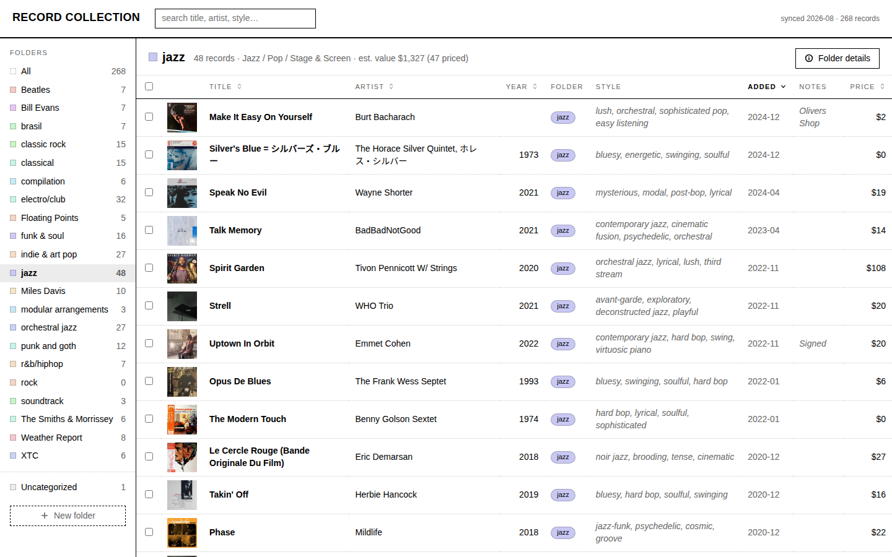
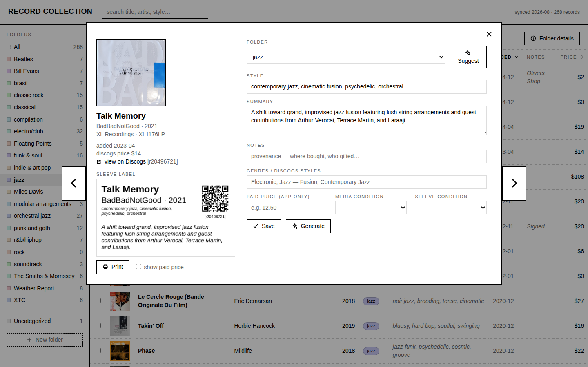
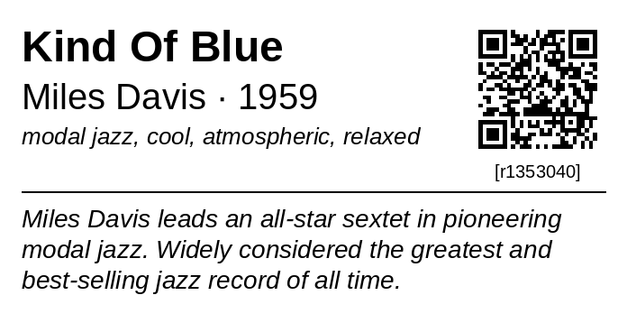
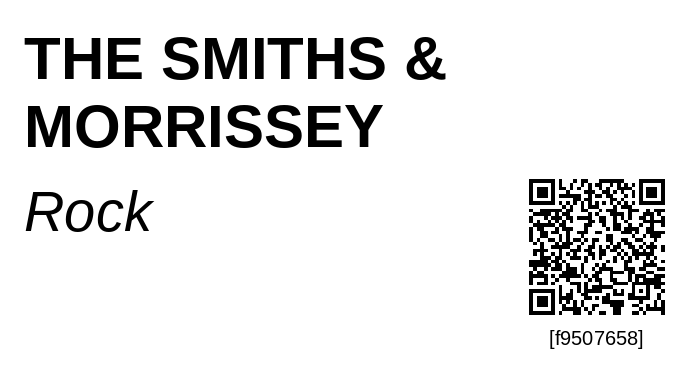
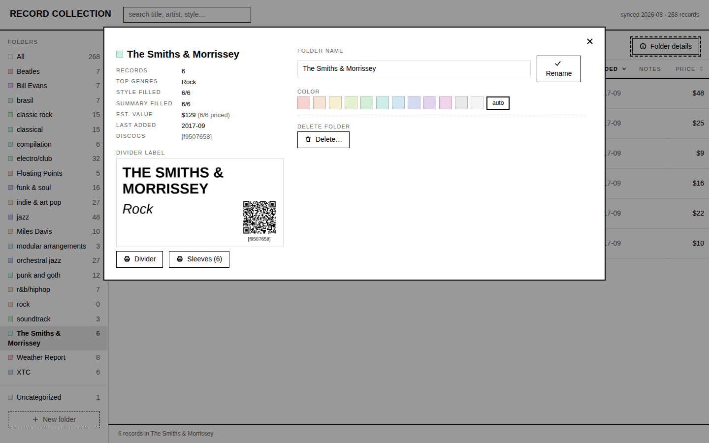

# Record Collection

Keeps a physical record collection in sync with [Discogs](https://www.discogs.com).
Each Discogs folder maps to a divider in a crate; each record gets a printed sleeve
label. A CLI syncs the collection into SQLite, a local web app handles browsing and
reorganizing, and labels print on a Brother QL label printer — or to PDF.



## Features

- **Sync** — the collection, folders, and custom fields (style, summary, notes,
  condition) mirror into a local database. Edits write back to Discogs immediately.
- **Organize** — drag a record's cover onto a folder to move it. Create, rename,
  delete, and color-code folders. Multi-select for bulk moves, printing, and
  AI enrichment.
- **Labels** — divider labels per folder and sleeve labels per record, with QR codes
  linking back to Discogs. Printed over USB (no driver needed) or written to PDF.
- **AI** *(optional)* — drafts the style and summary fields, suggests folders, and
  can file an entire uncategorized backlog. Without an OpenRouter key the app works
  normally and these features are simply disabled.

| Record details | Labels |
|---|---|
|  |   |

## Setup

1. Install [uv](https://docs.astral.sh/uv/) and clone this repo.
2. Get a [Discogs personal access token](https://www.discogs.com/settings/developers).
3. Optional, for the AI features: an [OpenRouter API key](https://openrouter.ai/keys).
4. Create your config:

   ```sh
   cp secrets.example.yaml secrets.yaml    # add your token(s)
   uv sync
   ```

5. Verify and pull your collection:

   ```sh
   uv run records auth
   uv run records sync
   uv run records serve    # → http://127.0.0.1:5033
   ```

To change the printer model or switch label output to PDF, copy
`settings.example.yaml` to `settings.yaml` and edit it.

## Commands

```sh
records sync                       # pull the collection from Discogs
records serve                      # start the web app
records labels --divider jazz      # print one divider ('all' for every folder)
records labels --sleeves jazz      # print sleeve labels for a folder
records labels --divider all --pdf out.pdf   # PDF instead of the printer
records summarize --missing        # AI-draft style/summary (add --write to save)
records classify --apply           # AI-file uncategorized records into folders
records backup                     # export paid prices + folder colors to JSON
records restore backup.json
```



## Notes

- Discogs is the source of truth. The app never queues offline edits — if Discogs
  is unreachable, an edit fails visibly.
- Labels are sized for a 62 mm continuous roll at 300 dpi and grow in length to fit
  their text. PDF output keeps the same physical size, one label per page.
- Prices in the table are Discogs lowest-listed prices, cached for a week.
  Purchase prices you enter stay local and are never sent to Discogs —
  `records backup` exports them.
- The web app binds to localhost with no authentication: single user, private machine.

## Development

`uv run pytest` runs the test suite. See [docs/spec.md](docs/spec.md) for the
architecture, [docs/frontend-styleguide.md](docs/frontend-styleguide.md) for frontend conventions,
and [docs/api-notes.md](docs/api-notes.md) for Discogs/OpenRouter/printer details.

See [CHANGELOG.md](CHANGELOG.md) for what's new and
[CONTRIBUTING.md](CONTRIBUTING.md) if you'd like to send a change.

## License

[MIT](LICENSE)
