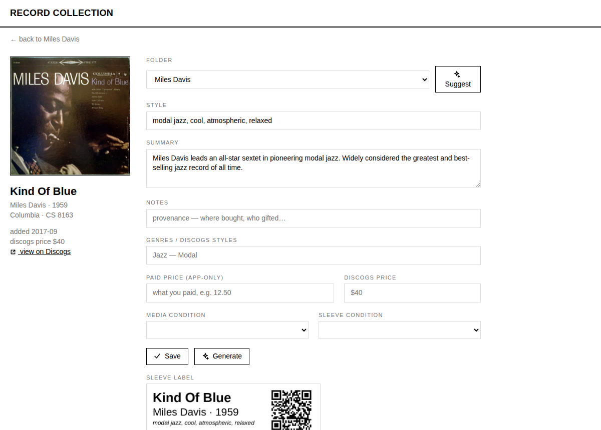

# Record Collection

A local tool for keeping a physical record collection in sync with
[Discogs](https://www.discogs.com). Each Discogs folder corresponds to a divider in a
crate; each record gets a printed sleeve label. A CLI (`records`) syncs the collection
into SQLite, a small web app handles browsing and reorganizing, and labels print
directly on a Brother QL printer.


## What it does

- **Sync**: pulls folders, items, and custom fields (Style, Summary, Notes,
  media/sleeve condition) from Discogs into a local SQLite mirror. Edits made in the
  app write back to Discogs immediately; Discogs stays the source of truth.
- **Browse and organize**: folder sidebar, sortable table, search. Drag a record's
  cover onto a folder to move it. Folders can be created, renamed, deleted (items are
  relocated first), and color-coded. Multi-select supports bulk moves, printing, and
  AI enrichment.
- **Labels**: divider labels (folder name, genres, QR code to the folder on Discogs)
  and sleeve labels (title, artist, year, style, summary, notes, QR code to the
  release). Rendered as PNGs and sent straight to a Brother QL over USB — no printer
  driver. Optionally includes the purchase price, which is stored locally and never
  sent to Discogs.
- **AI assistance** (via OpenRouter): drafts the Style and Summary fields from Discogs
  release notes or a web search, suggests a folder for a record, and can file an
  entire uncategorized backlog. Single-item drafts require explicit approval before
  saving; bulk enrichment saves directly.

| Sleeve label | Divider label |
|---|---|
|  |  |

## Setup

Requires Python 3.12+ and [uv](https://docs.astral.sh/uv/).

```sh
cp secrets.example.yaml secrets.yaml
uv sync
```

`secrets.yaml` needs two keys:

- `discogs_pat` — a [Discogs personal access token](https://www.discogs.com/settings/developers)
- `openrouter_key` — an [OpenRouter API key](https://openrouter.ai/keys) (only needed
  for the AI features)

## Usage

```sh
uv run records auth      # verify both keys, detect the printer
uv run records sync      # pull the collection into records.sqlite3
uv run records serve     # web app at http://127.0.0.1:5033
```

Labels, from the CLI or the web app:

```sh
uv run records labels --divider jazz             # print one divider label
uv run records labels --sleeves jazz             # print sleeve labels for a folder
uv run records labels --sleeves jazz --out /tmp  # write PNGs instead of printing
```

AI drafting and classification:

```sh
uv run records summarize --missing               # draft Style/Summary (dry run)
uv run records summarize --missing --write       # ...and save to Discogs
uv run records classify                          # suggest folders for Uncategorized
uv run records classify --apply                  # ...and move the records
uv run records classify --review jazz            # flag records that may not fit
```



## Notes

- The Discogs API is rate-limited to 60 requests/minute; the client throttles
  accordingly. A full sync of ~270 records takes a few seconds; bulk enrichment of a
  whole collection takes half an hour.
- Sleeve and divider labels are sized for a 62mm continuous roll (DK-22205) at
  300 dpi. Supported printers are the Brother QL series, via
  [brother-ql-next](https://pypi.org/project/brother-ql-next/).
- Folder QR codes link to the folder-filtered collection on discogs.com. The Discogs
  mobile app cannot deep-link into a filtered folder view; opening the link in a
  mobile browser works.
- Prices shown are Discogs lowest-listed prices, fetched lazily and cached for a
  week. Purchase prices live only in the local database.
- The web app binds to localhost and has no authentication; it is intended for
  single-user use on a private machine.

## Docs

- [docs/spec.md](docs/spec.md) — features and components
- [docs/dev-plan.md](docs/dev-plan.md) — development plan
- [docs/api-notes.md](docs/api-notes.md) — Discogs/OpenRouter/printer findings

## License

[MIT](LICENSE)
